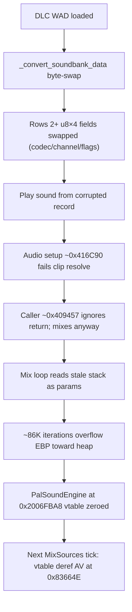

# Soundbank u8×4 periodic byte-swap — root cause & fix

**Date:** 2026-05-28  
**Status:** Fix present in `tools/ucfx_be_to_le.py` (`_convert_soundbank_data`)  
**Related:** [audio_crash_analysis.md](../../docs/audio_crash_analysis.md), [pandemic_audio_system_design.md](../../docs/pandemic_audio_system_design.md) §4.2, [packed_types_audit_audio.md](packed_types_audit_audio.md)

---

## Symptom (x32dbg)

| Item | Value |
|------|-------|
| Crash IP | `0x0083664E` — `mov eax, [eax+0x04]` inside `PalSoundEngine::MixSources` |
| `g_pPalSoundEngine` | `[0x01176404]` → `0x2006FBA8` |
| Object state | `MemoryIsValidPtr(0x2006FBA8)` false; 32 bytes at object all zero (vtable wiped) |
| Appearance | Use-after-free on audio mixer thread — object “destroyed” while mixer still running |

The UAF appearance is **secondary**. Hardware breakpoint tracing showed the vtable was **overwritten by a buffer overflow**, not freed by a destructor.

---

## Crash chain (revised timeline)



1. **DLC port** swaps Xbox BE soundbank bodies via `_convert_soundbank_data`.
2. **Corrupted u8×4** on sound 3+ — codec byte wrong → clip lookup fails at **`0x416C90`**.
3. **Unchecked setup failure** — caller at **`0x409457`** still enters mixing path.
4. **Stale stack as mix params** — loop counter ≈ `0x72656D61` (“amer” from script text); billions of iterations.
5. **Stack/heap smash** — mixing loop writes 8 bytes/iter; EBP walks into **`0x2006FBA8`** (PalSoundEngine) and zeros vtable.
6. **Next mixer tick** — `MixSources` at `0x836610` loads vtable from `[ECX]` → crash at **`0x83664E`**.

---

## Wrong vs right offset strategy

### Soundbank layout (116-byte record stride typical)

| Section | Range | Content | `record_stride` |
|---------|-------|---------|-----------------|
| Header | `[0, 32)` | counts, hashes, section offsets | — |
| **1 (A)** | `[data_start, section_off1)` | `sub_count` event records | `(section_off1 - data_start) / sub_count` |
| 2 (B) | `[section_off1, section_off2)` | `sub_count` × u32 indices | 4 |
| **3 (C)** | `[section_off2, section_off3)` | `sub_count2` param records | `(section_off3 - section_off2) / sub_count2` |
| 4 (D) | `[section_off3, end)` | `sub_count2` × u32 indices | 4 |

DLC banks can have **520 sounds** (~372 records in section 1). Base-game stride is often **116 bytes** (`0x1D × 4`, coinciding with `(sec_A / sub_count)`).

### Wrong: absolute body offsets (old `_SOUNDBANK_U8X4_BODY_OFFSETS`)

```text
{0x2C, 0x34, 0x4C, 0xA0, 0xA8, 0xC0}
```

These are **not six fields in one record**. With stride 116 and `data_start = 0x20`:

| Absolute | Record | Relative within record |
|----------|--------|------------------------|
| `0x2C` | row 0 | **12** — codec/channel flags |
| `0x34` | row 0 | **20** — playback flags |
| `0x4C` | row 0 | **44** — effect/routing flags |
| `0xA0` | row 1 | **12** |
| `0xA8` | row 1 | **20** |
| `0xC0` | row 1 | **44** |

Only **rows 0–1** were protected. Row 2+ had u8×4 fields treated as BE u32s and byte-swapped → silent setup failure.

### Right: periodic relative offsets

```python
_SOUNDBANK_U8X4_RECORD_RELATIVE = frozenset({12, 20, 44, ...})
# Applied per 4-byte body offset:
rel = (off - section_start) % record_stride
if rel in _SOUNDBANK_U8X4_RECORD_RELATIVE:
    continue  # do not swap
```

- **Section 1:** `section_start = data_start`, `record_stride = record_stride_a`
- **Section 3:** `section_start = section_off2`, `record_stride = record_stride_c`
- **Sections 2 & 4:** always full u32 swap (pure index tables)

**Field mapping (relative to each record base):**

| Rel | Abs (row 0, base 0x20) | Role |
|-----|------------------------|------|
| 12 | `0x2C` | Codec / channel flags (u8×4) |
| 20 | `0x34` | Playback flags (u8×4) |
| 44 | `0x4C` | Effect / routing flags (u8×4) |

The converter also lists `{128, 136, 160}` (absolute `0xA0/0xA8/0xC0` minus record-0 base). For stride **116** these never match `(off - base) % 116` (max rel = 115) — harmless; the periodic `{12, 20, 44}` set is the operative fix.

---

## Fix summary (in tree)

**File:** `tools/ucfx_be_to_le.py`  
**Function:** `_convert_soundbank_data` (approx. lines 1201–1314)

1. `record_stride_a = (section_off1 - data_start) // sub_count` (not `header[0] × 4` as count semantics).
2. `record_stride_c` from section C / `sub_count2`.
3. For each 4-byte offset in sections 1 and 3, skip swap when `(off - section_start) % stride ∈ _SOUNDBANK_U8X4_RECORD_RELATIVE`.
4. Sections 2 and 4 remain full u32 swap.

**Rebuild:** `make dlc-port` (or equivalent) to regenerate `vz-patch.wad`.

**Fallbacks:** `--strip-audio` on `dlc_port.py`; ASI null-guard at `MixSources` vtable read (symptom only).

---

## x32dbg investigation notes

| Address | Role |
|---------|------|
| `0x2006FBA8` | `PalSoundEngine` instance — overflow target; vtable zeroed before crash |
| `0x01176404` | `g_pPalSoundEngine` — still held dangling pointer |
| `0x836610` / `0x83664E` | `MixSources` entry / crash IP (vtable deref) |
| `0x416C90` | Audio setup — fails when codec/flags corrupted; returns without init buffer |
| `0x409457` | Caller that ignores setup failure and enters mix path |
| `0x831EE0` | Audio mixer thread loop (`WaitForSingleObject` → `MixSources`) |

See also: `.cursor/research/x32dbg_probe_resolution_v1.md` for probe catalog.

---

## Validation gaps

| Tool | Gap |
|------|-----|
| `_validate_dlc_soundbanks.py` | Uses `record_stride = count_le * 4` for display; should use `(section_off1 - data_start) / sub_count`. Flags `>2` records but does **not** verify u8×4 bytes at row ≥ 2 match PC retail. |
| `audit_dlc_conversion.py` | No soundbank u8×4 / multi-record check. |
| `verify_ucfx_endian.py` | No soundbank-specific validation. |
| `wad_simulator/.../soundbank.rs` | `U8X4_OFFSETS` still documents absolute `{0x2C,…,0xC0}`; simulator reads u8 only (no swap) — doc drift vs Python. |
| Unit tests | None for periodic u8×4 skip on record index ≥ 2. |

**Suggested follow-up commands** (when retail PC `vz.wad` + patch WAD available):

```bash
.venv/bin/python3 tools/_validate_dlc_soundbanks.py output/data/vz-patch.wad
.venv/bin/python3 tools/_wad_audio_compare.py
.venv/bin/python3 tools/audit_dlc_conversion.py --patch-wad output/data/vz-patch.wad --source-wad "<retail PC vz.wad>"
```

Ideal regression: for each DLC soundbank with `sub_count > 2`, round-trip Xbox body through `_convert_soundbank_data` and assert bytes at `record_base + {12,20,44}` for `record_index >= 2` match PC retail LE body.
