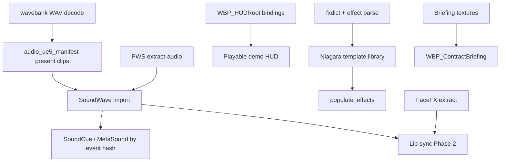

# Audio, Effects, FaceFX, and UI → UE5 Path

**Date:** 2026-05-30  
**Purpose:** Bridge Mercenaries 2 binary audio/VFX/UI middleware to UE5 systems. Complements [`gameplay_data_ue5_mapping.md`](gameplay_data_ue5_mapping.md) sections 7–14.

**Related tools:** [`tools/wavebank_extractor.py`](../tools/wavebank_extractor.py), [`tools/audio_ue5_manifest.py`](../tools/audio_ue5_manifest.py), [`tools/dlc_audio_manifest.py`](../tools/dlc_audio_manifest.py), [`tools/pws_extractor.py`](../tools/pws_extractor.py), [`game-scripts/import_audio.py`](../game-scripts/import_audio.py), [`game-scripts/setup_audio_import.py`](../game-scripts/setup_audio_import.py), [`game-scripts/setup_basic_hud.py`](../game-scripts/setup_basic_hud.py)

**Engine design reference:** [`pandemic_audio_system_design.md`](pandemic_audio_system_design.md)

---

## 1. Audio — wavebank / soundbank → UE5

### 1.1 Source assets

| ASET type | type_hash | Count | Role |
|-----------|-----------|-------|------|
| **wavebank** | `0xF753F6D0` | 95 | Embedded IMA ADPCM clips (36 B mono / 72 B stereo blocks) |
| **soundbank** | `0x9F8BCA10` | 76 | Event → clip routing (4 body sections, ~116 B event stride) |
| **sounddb** | `0xE5273C14` | 77 | Block-level audio package manifest (load order) |
| **PWS streams** | — | ~100+ files | Standalone `data/Audios/*.pws` (music, VO, ambience) |

Runtime chain (from design doc):

```
Sound.CueSound("explosion_small")
  → soundbank event hash
  → wavebank clip_hash
  → IMA decode → mixer voice
```

### 1.2 Extraction pipeline (existing + planned)

| Stage | Tool | Output |
|-------|------|--------|
| PWS stream carve | `make extract-audio` → `pws_extractor.py` | `output/extracted_audio/<name>/riff_*.bin` + `pws_manifest.json` |
| DLC clip inventory | `dlc_audio_manifest.py` | `output/analysis/dlc_audio_manifest.json` (codec, streaming flags) |
| Embedded clip decode | **`wavebank_extractor.py`** | `output/extracted/audio/wavebanks/{wb_hash}/clip_{clip_hash}.wav` |
| **Planned:** soundbank sidecar | future `soundbank_extractor.py` | `output/extracted/audio/soundbanks/{sb_hash}.json` (event → clip map) |
| UE5 import index | **`audio_ue5_manifest.py`** | `output/ue5_import/metadata/audio_ue5_manifest.json` |

The manifest tool is **lightweight**: it indexes existing extractions and assigns canonical paths for clips not yet decoded. It does not decompress WADs.

```bash
python tools/audio_ue5_manifest.py --pipeline-root ./output \
  --clips-json output/analysis/dlc_audio_manifest.json \
  -o output/ue5_import/metadata/audio_ue5_manifest.json
```

Optional `--blocks-dir output/extracted/batch_vz/blocks` parses pre-decompressed blocks for soundbank section-B → clip hash linkage (no WAD I/O).

### 1.3 UE5 target systems

| Game concept | UE5 asset | Notes |
|--------------|-----------|-------|
| Wavebank clip | `USoundWave` | Import WAV; set `SampleRate`, mono/stereo from manifest |
| Soundbank event | `USoundCue` or `UMetaSoundSource` | One cue per `clip_hash` or grouped by block (vehicle, weapon) |
| 3D positional SFX | `USoundAttenuation` | Categories: weapons, explosions, vehicles, footsteps |
| Music / long VO | `USoundWave` streaming | From PWS RIFF/Ogg extractions; enable streaming load |
| Concurrent voices | `USoundConcurrency` | Mirror PalSoundEngine voice limits (~32–64) |
| Lua `Sound.CueSound(name)` | DataTable row | `event_hash` → Soft Object Path to SoundCue |

**Recommended import layout** (created by `setup_audio_import.py`):

```
/Game/Mercs2/Audio/
  Wavebanks/{bank_name}/SC_{clip_hash}     ← SoundWave or SoundCue
  Soundbanks/{bank_name}/                  ← MetaSound graphs (optional)
  Streams/{pws_name}/                      ← music / VO
  Attenuation/                             ← ATTN_Weapon, ATTN_Vehicle, …
  MetaSounds/                              ← procedural layering if needed
  Classes/                                 ← SC_Explosion, SC_UI, …
```

### 1.4 Gaps

- ~~No `wavebank_extractor.py`~~ — **done** (IMA ADPCM codec `0x02` → WAV; verified on `ui_hud` block)
- Soundbank event names unresolved (hash-only in section A/B)
- `sounddb` (0xE5273C14) group load order not parsed into manifest
- `import_audio.py` stub exists; Interchange batch import needs in-Editor validation

---

## 2. Effects — fxdict + effect + scrub → UE5

### 2.1 Source assets

| ASET type | type_hash | Count | Location | Role |
|-----------|-----------|-------|----------|------|
| **fxdict** | `0xFA46D8A8` | 1 | **`resident`** block | Global parameter dictionary (INFO+DICT, 630×20 B records, name `"fx"`) — see [`fxdict_format.md`](fxdict_format.md) |
| **effect** | `0x5608BD5A` | 314 | `effects` block | Particle/VFX definitions (all entries) |
| **scrub** | `0x600B904E` | 1,026 | c3 cells | Compiled shader + material packages (SCRB+MTRL+STRM+INFO) |

**ECS link:** `ScrubObject` COMP (1,033 entities) stores a **scrub hash** per placed object — ties world instances to SCRB material packages.

Mercs 1 lineage: `RedEffect` / `EffectSystem` managed particles; Mercs 2 consolidates definitions in the single `effects` block with a shared `fxdict`.

### 2.2 Conversion strategy

```
fxdict (parameter names, defaults)
    ↓ referenced by
effect entries (emitter count, texture refs, blend modes, lifetimes)
    ↓ rendered via
scrub packages (D3D9 pixel/vertex shaders + MTRL texture slots)
    ↓ placed as
ScrubObject / particle entities in layers_static (skipped by populate_world today)
```

| Game layer | UE5 target | Approach |
|------------|------------|----------|
| **fxdict** | `UNiagaraParameterCollection` or DataTable | Parse INFO+DICT → named float/vector params; one NPC per game |
| **effect** (314) | `UNiagaraSystem` | One system per effect hash; modules approximate RedEffect behavior (spawn rate, lifetime, size, velocity) |
| **scrub** textures | Existing PNG pipeline | Reuse `texture_extractor.py` outputs referenced by MTRL chunks |
| **scrub** shaders | `UMaterial` / `UMaterialInstanceConstant` | **Manual rebuild** — SCRB is compiled D3D9 bytecode; no direct import. Match blend mode + texture slots from MTRL/STRM |
| World placements | `ANiagaraActor` | Extend `populate_world.py` to spawn effects for entities matching `particle` / effect name patterns |

### 2.3 Suggested tooling order

1. **`effect_extractor.py`** — parse `effects` block UCFX; emit `effect_catalog.json` (hash, fxdict param refs, texture hashes)
2. ~~**`fxdict_parser.py`**~~ — **done** — decode INFO+DICT → JSON ([`fxdict_format.md`](fxdict_format.md)); use with `extract_single_block.py` on resident
3. **`scrub_material_index.py`** — map scrub hash → MTRL texture list (join with texture_index.json); interim: [`material_probe.py`](../tools/material_probe.py)
4. **Niagara template library** — base modules: sprite burst, mesh debris, smoke ribbon, muzzle flash
5. **`populate_effects.py`** — place Niagara actors from placement JSON where entity names contain `particle`, `fx_`, `explosion`

### 2.4 Gaps

- fxdict INFO+DICT **decoded** (630×20 B records); per-parameter **names** still hash-only — see [`fxdict_format.md`](fxdict_format.md) confidence table
- effect record stride / field map **partial** (`effect_block_probe.py`); no consolidated `effect_catalog.json` yet
- SCRB shader bytecode not disassemblable to UE material graphs automatically
- No correlation yet between effect hash and scrub hash for composite VFX

---

## 3. FaceFX — lip-sync replacement

### 3.1 Source assets

| ASET type | type_hash | Count | Role |
|-----------|-----------|-------|------|
| **facefxanimationset** | `0x665EF13E` | 86 | Pre-baked animation curves (44–46 KB); contract/briefing blocks |
| **facefxactor** | `0x1CF649BB` | 31 | Facial rig definitions; starter / character blocks |

Found in mission blocks (`mec001_contract`, `briefing_job_chris`, etc.) alongside dialogue scripts and Scaleform briefings.

### 3.2 UE5 replacement options

| Approach | Pros | Cons | Recommendation |
|----------|------|------|----------------|
| **A. MetaHuman + Audio2Face** | High quality, UE-native | Requires MetaHuman face mesh; not 1:1 with M2 rigs | Long-term cinematics |
| **B. Morph targets + curve import** | Matches original face meshes | Need FaceFX format decoder + morph name map | Best fidelity for recreated characters |
| **C. OCULUS Lip Sync / runtime viseme** | Fast to ship | Does not match original performances | Placeholder / generic NPCs |
| **D. Skip lip-sync; subtitle-only** | Zero extraction cost | Loses cinematic polish | Early demo acceptable |

**Recommended path:**

1. **Phase 1:** Subtitles from `stringdb` / dialog fragments; no mouth animation
2. **Phase 2:** Decode FaceFX `.fxa` curve data → CSV `(time, morph_name, value)` per `facefxanimationset` hash
3. **Phase 3:** Bind curves to character Blueprint `USkeletalMeshComponent` morph targets; sync to imported VO WAV (from PWS / future dialog audio extraction)
4. **Phase 4:** Evaluate Audio2Face for new recordings; keep imported curves for retail dialogue

### 3.3 Tooling needed

- `facefx_extractor.py` — carve UCFX `data` bodies from contract blocks
- FaceFX binary format research (FaceFX SDK docs / community reverse engineering)
- `game-scripts/import_facefx_curves.py` — Level Sequence or AnimSequence from CSV

### 3.4 Gaps

- Zero extraction tooling today
- Unknown mapping from `facefxactor` → skeleton morph target names
- Dialogue audio lines not linked to animation set hashes

---

## 4. Scaleform / Flash GFX → UMG

### 4.1 Source assets

| ASET type | type_hash | Count | Role |
|-----------|-----------|-------|------|
| **scaleformgfx** | `0xFE0E8320` | 60 | CFX container + zlib Flash-derived UI (HUD, menus, briefings) |

Co-located in `c316XX` UI blocks and contract blocks. Briefing **textures** (DXT1/DXT5) are already extracted; **layout/actionscript** is not.

### 4.2 Existing UE5 scaffold

[`setup_basic_hud.py`](../game-scripts/setup_basic_hud.py) creates:

- `/Game/UI/HUD/WBP_HUDRoot` — health, ammo, minimap, faction bars, crosshair
- `/Game/UI/HUD/WBP_PauseMenu` — pause menu shell

Widget **trees** only — Blueprint event graphs must be wired manually.

### 4.3 UMG migration strategy

| Scaleform screen | Evidence | UMG target | Priority |
|------------------|----------|------------|----------|
| In-game HUD | `ui_hud` block (soundbank + wavebank) | `WBP_HUDRoot` (exists) | **P0** |
| Pause / options | `c316` blocks | `WBP_PauseMenu` (exists) | **P0** |
| Contract briefing | `scaleform_pmccon###briefing` textures | `WBP_ContractBriefing` per contract | **P1** |
| Map / PDA | Lua + scaleform refs | `WBP_Map` | **P2** |
| Vendor / shop | contract blocks | `WBP_Shop` | **P3** |

**Workflow per screen:**

1. Capture reference video / retail screenshots for layout
2. Import briefing textures to `/Game/UI/Textures/Briefings/`
3. Recreate layout in UMG (anchors, overlays, font approximations — retail uses Scaleform TTFs from `font` type_hash assets)
4. Bind to C++ or Blueprint game state (health, ammo, faction standing) — mirror Lua `UI_*` bindings from [`lua_engine_bindings_audit.md`](lua_engine_bindings_audit.md)
5. **Do not** attempt SWF/GFX decompilation as primary path — texture + screenshot reference is faster and UE-native

### 4.4 Font / localization

- `font` type_hash (`0x99E77ACE`, 9 entries) — bitmap/TTF fonts for Scaleform; extract for UMG `FSlateFontInfo`
- `stringdb` — pair with UI widget text blocks

### 4.5 Gaps

- CFX/zlib payload not decoded to SWF
- ActionScript → Blueprint behavior mapping not started
- No `WBP_ContractBriefing` scaffold yet

---

## 5. Prioritized implementation order

Cross-track dependency graph:



### Phase 0 — Scaffold (done / this PR)

- [x] `audio_ue5_manifest.py` — hash → path index
- [x] `setup_audio_import.py` — Content/Audio folders
- [x] `setup_basic_hud.py` — HUD widget trees
- [x] This document

### Phase 1 — Audio MVP (highest ROI for demo)

1. [x] **`wavebank_extractor.py`** — IMA ADPCM (`0x02`) → WAV into `extracted/audio/wavebanks/{wb_hash}/`
2. [ ] **Re-run `audio_ue5_manifest.py`** until `clips_present` > 90% (per-block smoke: ui_hud = 29/29 embedded)
3. [ ] **`import_audio.py`** — Editor Python: SoundWave batch import from manifest (stub in repo)
4. [ ] **Attenuation presets** — weapon, explosion, vehicle, UI
5. [x] **Keep `extract-audio` PWS path** for music + VO streams

**Smoke test (retail PC, no full WAD rebuild):**

```bash
.venv/Scripts/python.exe tools/wavebank_extractor.py --extract-from-wad \
  --wad game-files/pc-game-vz.wad --path ui_hud_P000_Q3 --pipeline-root output
.venv/Scripts/python.exe tools/audio_ue5_manifest.py --pipeline-root output \
  -o output/ue5_import/metadata/audio_ue5_manifest.json
```

Manifest marks clips `present` when `output/extracted/audio/wavebanks/{wavebank_hash:08X}/clip_{clip_hash:08X}.wav` exists. After `wavebank_extractor.py`, re-running `audio_ue5_manifest.py` scans that tree via `scan_decoded_wavebanks()` (no `--blocks-dir` required). Optional `--blocks-dir` adds soundbank section-B linkage and full clip metadata from block binaries.

### Phase 2 — HUD + core UI

1. Wire `WBP_HUDRoot` bindings (health, ammo, minimap placeholder)
2. GameMode HUD spawn + input toggle for pause menu
3. `WBP_ContractBriefing` using existing briefing PNGs

### Phase 3 — World feedback

1. **`effect_extractor.py` + `fxdict_parser.py`**
2. Niagara templates for top 20 effect hashes (explosions, smoke, muzzle)
3. **`populate_effects.py`** for visible combat feedback

### Phase 4 — Cinematics polish

1. **`facefx_extractor.py`** + morph curve import
2. Link VO streams to FaceFX sets per contract block
3. Remaining Scaleform screens (map, shop)

### Phase 5 — Materials fidelity

1. **`scrub_material_index.py`** — scrub hash → texture slots
2. Manual UE material rebuild for terrain/world scrub shaders
3. Join `ScrubObject` ECS placements to material instances

---

## 6. Makefile targets (proposed)

```makefile
audio-ue5-manifest:
	$(PYTHON) tools/audio_ue5_manifest.py --pipeline-root $(OUTPUT) \
	  -o $(OUTPUT)/ue5_import/metadata/audio_ue5_manifest.json
```

Optional Makefile target (proposed):

```makefile
wavebank-extract-ui-hud:
	$(PYTHON) tools/wavebank_extractor.py --extract-from-wad \
	  --wad game-files/pc-game-vz.wad --path ui_hud_P000_Q3 --pipeline-root $(OUTPUT)
```

---

## 7. See also

- [`pandemic_audio_system_design.md`](pandemic_audio_system_design.md) — PalSoundEngine load path
- [`type_hash_registry.md`](type_hash_registry.md) — all resolved type names
- [`gameplay_data_ue5_mapping.md`](gameplay_data_ue5_mapping.md) — placements, ECS, Data Layers
- [`loading_shell_wad_analysis.md`](loading_shell_wad_analysis.md) — `ui_hud` block audio co-location
