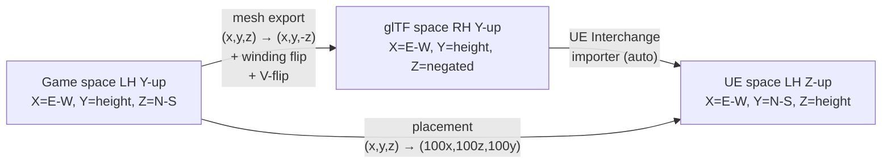

# Coordinate System Reference

Complete documentation of coordinate system transformations between the game
binary data, glTF export, and Unreal Engine 5.

---

## The Three Systems

| System | Handedness | Up axis | Forward | Right | Convention |
|--------|-----------|---------|---------|-------|------------|
| Game (D3D9) | Left | +Y | +Z (north) | +X (east) | Left-handed Y-up |
| glTF 2.0 | Right | +Y | -Z | +X | Right-handed Y-up |
| UE5 | Left | +Z | +X | +Y | Left-handed Z-up |



---

## Position Transforms

### Mesh Pipeline (game → glTF → UE)

1. **Game → glTF** (`tools/mercs2_coords.py`):
   - Position: `(x, y, z)` → `(x, y, -z)` (Z-negate)
   - Normals: `(nx, ny, nz)` → `(nx, ny, -nz)`
   - Tangent W: negated (handedness flip)
   - Triangle winding: reversed (`a,b,c` → `a,c,b`)
   - UV: `(u, v)` → `(u, 1-v)` (D3D9 V=0-top → glTF V=0-bottom)

2. **glTF → UE** (UE Interchange importer, automatic):
   - RH Y-up → LH Z-up conversion
   - Scale: glTF meters → UE centimeters (×100)

### Placement Pipeline (game → UE directly)

```python
def game_to_ue(x, y, z):
    return (x * 100, z * 100, y * 100)  # swap Y↔Z, scale to cm
```

Both pipelines produce the same UE position for any given game point.

---

## Rotation Transforms

### Why rotation works differently from position

The mesh pipeline gets the "free" RH→LH conversion from UE's glTF importer.
Placements bypass glTF entirely. The direct `(x,y,z)→(x,z,y)` swap is a
coordinate relabeling that preserves left-handedness (it's an even permutation
composed with the identity on handedness). Therefore rotations transfer directly.

### Yaw (Y-axis rotation in game → Z-axis rotation in UE)

Game yaw is a rotation around +Y (up). In UE, the corresponding "up" rotation
is around +Z. Because both systems are left-handed and the swap preserves this,
a positive yaw in game (clockwise when viewed from above) corresponds to the
same positive yaw in UE.

```python
def game_yaw_to_ue_yaw_deg(game_yaw_rad: float) -> float:
    return math.degrees(game_yaw_rad)
```

### Full Quaternion (preserving pitch and roll)

Game quaternion `(qx, qy, qz, qw)` is defined in LH Y-up basis.
To convert to LH Z-up, swap the Y and Z imaginary components:

```python
ue_qx = game_qx   # X axis unchanged
ue_qy = game_qz   # game Z → UE Y (N-S axis)
ue_qz = game_qy   # game Y → UE Z (up axis)
ue_qw = game_qw   # scalar unchanged
```

Then decompose `(ue_qx, ue_qy, ue_qz, ue_qw)` into Euler angles using
standard ZYX aerospace convention to get UE's `Rotator(pitch, yaw, roll)`.

Implementation: `tools/mercs2_coords.py` → `game_quat_to_ue_rotator_deg()`

---

## Terrain Atlas Orientation

The terrain atlas `vz_lrterrain.png` (2048×2048) has the following mapping:

| Atlas position | Game coordinate | Cardinal |
|---------------|-----------------|----------|
| pixel (row=0, col=0) — top-left | (x=-4000, z=-4000) | Southwest |
| pixel (row=0, col=2047) — top-right | (x=+4000, z=-4000) | Southeast |
| pixel (row=2047, col=0) — bottom-left | (x=-4000, z=+4000) | Northwest |
| pixel (row=2047, col=2047) — bottom-right | (x=+4000, z=+4000) | Northeast |

**Image top = south (low Z), image bottom = north (high Z).**

This was verified by Pearson correlation of placement density vs atlas luma
(r=+0.28 for original orientation; all rotations/flips scored worse).

### UV synthesis for terrain

```python
u = (x + 4000) / 8000                # u=0 at west, u=1 at east
v = 1.0 - (z + 4000) / 8000          # V-flip for glTF convention
                                      # v=1 at south (image top), v=0 at north (image bottom)
```

---

## Worked Examples

### Example 1: PMC HQ Position

Game coordinates: `(2647, 10, -951)`

**Mesh pipeline:**
- glTF: `(2647, 10, 951)` (Z negated)
- UE importer (RH Y-up → LH Z-up, ×100): `(264700, 95100, 1000)`

**Placement pipeline:**
- `game_to_ue(2647, 10, -951)` = `(264700, -95100, 1000)`

Note: these differ in the Y sign because mesh Z-negate and UE importer Y-axis
direction differ from the direct placement swap. The correct UE position for the
PMC HQ is approximately `(264400, -95100, 1000)` per placement data.

### Example 2: 45° Yaw Rotation

A wall facing northeast in the game:
- Game: `rot_sin = 0.707, rot_cos = 0.707` → `yaw_rad = atan2(0.707, 0.707) = π/4`
- UE: `game_yaw_to_ue_yaw_deg(π/4) = 45.0°`
- Applied as `unreal.Rotator(0, 45, 0)` — facing northeast in UE viewport

### Example 3: Tilted Tire (Full Quaternion)

A tire lying at an angle:
- Game quat: `(qx=0.25, qy=0.1, qz=-0.3, qw=0.91)` (normalized)
- UE quat: `(0.25, -0.3, 0.1, 0.91)` (swap qy↔qz)
- Decompose → `Rotator(pitch, yaw, roll)` with all three components preserved

---

## Implementation Files

| File | Responsibility |
|------|---------------|
| `tools/mercs2_coords.py` | All coordinate conversion functions |
| `tools/gltf_exporter.py` | Applies mesh LH→RH transforms |
| `tools/terrain_extractor.py` | Terrain UV synthesis + direct GLB |
| `game-scripts/populate_world.py` | `game_to_ue()` + `placement_to_rotator()` |
| `game-scripts/populate_pmc_base.py` | Same as above for PMC subset |
| `viewer/placement-bbox-store.js` | `gameYawToUeYawDeg()` for web viewer |
| `game-scripts/setup_rotation_test_grid.py` | Empirical rotation test harness |
| `tools/validate_rotation_pipeline.py` | CLI rotation comparison tool |
