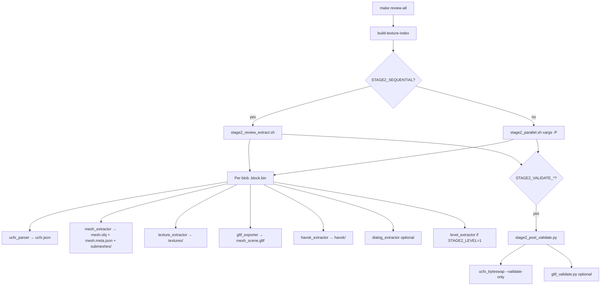

# Stage 2 review — accuracy improvements

Stage 2 turns every decompressed `batch_*/blocks/*.block.bin` into a per-asset review tree under `extracted/review/`. Since the original `full-pipeline` flow, format knowledge and Rust validators have outpaced what stage 2 alone guarantees. This document maps the current flow, gaps, and the hooks added to close them.

---

## Current stage 2 flow



**Makefile entry:** `make review-all OUTPUT=./output` (runs after stage 1 via `extract-all`, or standalone once `extracted/batch_*/blocks/` exist).

**Scripts:** `scripts/stage2_review_extract.sh` (sequential), `scripts/stage2_parallel.sh` (default, up to 48 workers).

**Per-blob outputs:** `ucfx.json`, `mesh.meta.json`, `submeshes/`, `textures/`, `mesh_scene.gltf`, `havok/`, `dialog_fragments.json`, optional `level_hints.json`.

---

## What changed since original stage 2

| Capability | Location | Stage 2 relevance |
|------------|----------|-------------------|
| Rust `ucfx_byteswap` + `validate_converted_block` | `tools/wad_simulator/crates/ucfx_byteswap` | CSUM, DEPS u8 count, SKIN, watr, fxdict, IBUF — **not run by Python extractors** |
| `wad_simulator` consumption | `tools/wad_simulator` | Full WAD load path; too heavy per blob — use for patch/audio gates, not every review blob |
| Type hash registry 35/35 | `mercs2_formats::types` | Rust validation uses correct skip lists (texture/animation) |
| `extract_single_block.py` | `tools/` | Probing one block — **not** integrated into bulk stage 2 (by design) |
| `watermap_decode`, `fxdict_parser`, `material_probe` | `tools/` | Specialized decoders — optional `STAGE2_LEVEL=1` hints only |
| `condense_placements.py` | `tools/` | **Stage 3** (`extract-placements`), not stage 2 |
| `validate_meshes.py` | `tools/` | Compares against `Models Archives/` OBJ goalposts — manual QA, not bulk |
| `scan_json_quality.py` | `tools/` | Fast JSON NaN/schema sample on review tree — manual |
| Byte-swap policy | `AGENTS.md`, `ucfx_be_to_le.py` | Applies to **DLC port**, not retail PC blobs (already LE) |

---

## Gaps (before this work)

1. **No structural validator on retail LE blobs** — Python parsers could emit plausible JSON/OBJ with bad CSUM, DEPS size, or SKIN layout.
2. **No glTF regression** — `mesh_scene.gltf` vertex/triangle counts were not checked against `submeshes/*.obj`.
3. **Makefile did not pass** `STAGE2_ANIM`, `STAGE2_LEVEL`, `STAGE2_EMBEDDED_AUDIO` into `review-all`.
4. **Windows venv** — stage 2 scripts only probed `.venv/bin/python`, not `.venv/Scripts/python.exe`.
5. **Specialized chunks** (watr, fxdict, DEPS) — only fully validated in Rust; stage 2 did not surface failures.

---

## Implemented improvements

### 1. `ucfx_byteswap --validate-only`

Validates an existing **PC LE** decompressed block without BE→LE conversion. Same checks as post-DLC-swap validation: entry table, CSUM, descriptors, DEPS/watr/fxdict/SKIN, IBUF bounds.

```bat
ucfx_byteswap --validate-only path\to\block.bin
ucfx_byteswap --stdin --validate-only < block.bin
```

### 2. Post-validate hook (`STAGE2_VALIDATE_*`)

| Variable | Default | Effect |
|----------|---------|--------|
| `STAGE2_VALIDATE_RUST` | `0` | After stage 2, run Rust validate on decompressed blobs |
| `STAGE2_VALIDATE_GLTF` | `0` | Run `gltf_validate.py` on dirs with `mesh_scene.gltf` |
| `STAGE2_VALIDATE_SAMPLE` | `0` | Cap blob count (`0` = all) |
| `STAGE2_VALIDATE_JOBS` | `8` | Parallel Rust workers |
| `STAGE2_VALIDATE_STRICT` | `0` | Non-zero exit on any Rust issue |

**Tools:** `tools/stage2_post_validate.py`, `scripts/stage2_post_validate.sh`

**Makefile:** `make stage2-post-validate OUTPUT=./output` (builds byteswap, runs Rust validate; set `STAGE2_VALIDATE_GLTF=1` for glTF pass).

Report written to `extracted/review/stage2_validate_<timestamp>.json`.

### 3. Makefile / script wiring

- `review-all` exports all `STAGE2_VALIDATE_*` and previously missing `STAGE2_ANIM` / `STAGE2_LEVEL` / `STAGE2_EMBEDDED_AUDIO`.
- Stage 2 scripts: Windows `.venv/Scripts/python.exe` detection.

---

## Concrete accuracy wins

| Check | Catches |
|-------|---------|
| CSUM mismatch | Truncated/corrupt UCFX container or wrong CRC poly |
| DEPS `u8` count + body size | Blind u32-swap style corruption |
| SKIN sentinel + nested PRMG | Wrong skin chunk layout; weight offset errors @+16/+20 |
| watr 495 669 B payload | Watermap grid corruption |
| fxdict INFO/DICT sizes | Effect dictionary mis-parse |
| IBUF index ≥ vertex count | Mesh index buffer overread |
| gltf_validate | Exporter drift vs `submeshes/*.obj` |

---

## Recommended runs

### Powerful machine — full retail review with validation

```bash
make build-ucfx-byteswap
make review-all OUTPUT=./output \
  STAGE2_JOBS=32 \
  STAGE2_VALIDATE_RUST=1 \
  STAGE2_VALIDATE_GLTF=1
```

### Resume after partial stage 2 (geometry OK, re-validate only)

```bash
make stage2-post-validate OUTPUT=./output STAGE2_VALIDATE_GLTF=1
```

### Fast smoke (500 random blobs)

```bash
make stage2-post-validate OUTPUT=./output \
  STAGE2_VALIDATE_SAMPLE=500 STAGE2_VALIDATE_JOBS=16
```

### glTF-only fix pass

```bash
STAGE2_SKIP_UCFX=1 STAGE2_SKIP_MESH=1 STAGE2_SKIP_TEX=1 \
  STAGE2_SKIP_HAVOK=1 STAGE2_DIALOG=0 \
  make review-all OUTPUT=./output
# then
make stage2-post-validate OUTPUT=./output STAGE2_VALIDATE_GLTF=1
```

### Full WAD consumption (not stage 2 — patch / integration QA)

```bash
wad_simulator --wad game-files/pc-game-vz.wad --asset-limit 1000
```

---

## Future work (not in stage 2 by default)

| Item | Rationale |
|------|-----------|
| Per-blob `watermap_decode` / `fxdict_parser` in stage 2 | Slow; run via `extract_single_block.py` on known resident blocks |
| `wad_simulator` on every blob | Requires WAD context + ASET; use sample limits |
| `scan_json_quality.py` in Makefile | Large review trees; run manually on `extracted/review` |
| Schema-driven ECS in `ucfx_parser` | Placement pipeline (`extract-placements`) owns ECS merge |
| SKIN weights in `anim_gltf_export` | Export glue — see `docs/glue_gap_closeout.md` |

---

## Related

- `tools/wad_simulator/README.md` — validation matrix
- `docs/glue_gap_closeout.md` — Rust vs Python glue backlog
- `.cursor/notes/wad_simulator_validation_audit.md` — detailed simulator audit
- `AGENTS.md` — pipeline stages and `STAGE2_*` env vars
